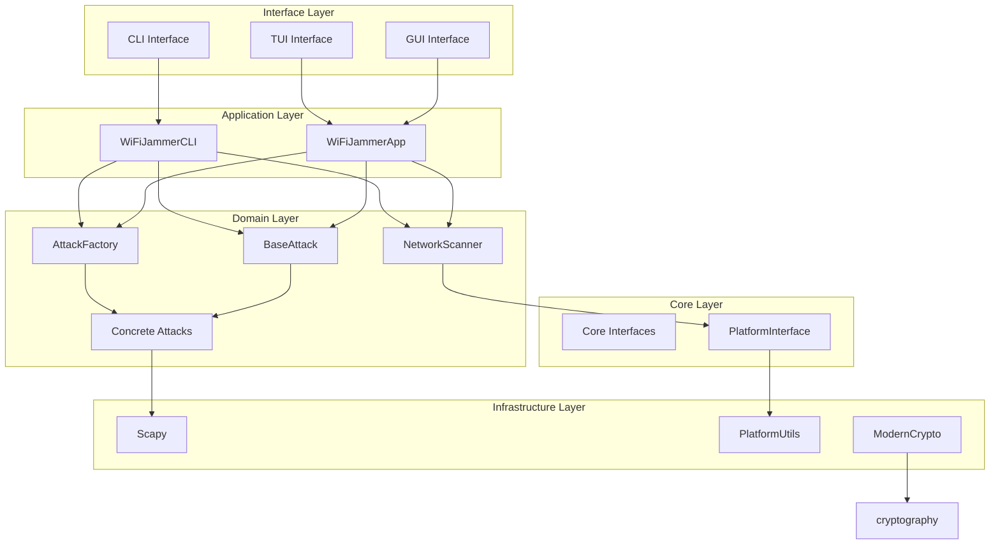
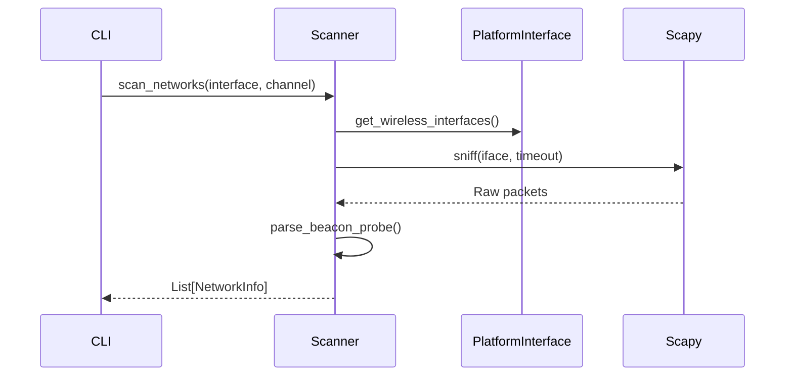
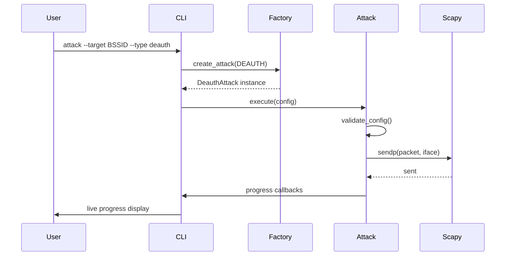

# WiFi Jammer Tool - Architecture

## Architecture Pattern

The WiFi Jammer Tool follows a **Modular Monolith** architecture with **Clean Architecture** principles:

- **Dependency Rule**: Inner layers (core) don't depend on outer layers (interfaces, GUI)
- **Interface Segregation**: Small, focused interfaces for each capability
- **Factory Pattern**: Dynamic attack creation and registration
- **Platform Abstraction**: Cross-platform support via factory and strategy patterns

## Component Diagram



## Core Interfaces

| Interface | Purpose | Implementations |
|-----------|---------|-----------------|
| `INetworkScanner` | Network discovery and client scanning | `ScapyNetworkScanner` |
| `IAttackStrategy` | Attack execution interface | `BaseAttack` subclasses |
| `IAttackFactory` | Dynamic attack creation | `AttackFactory` |
| `ILogger` | Structured logging | `RichLogger` |
| `IConfigManager` | Configuration management | `ConfigManager` |

## Attack Strategy Pattern

All attacks inherit from `BaseAttack` which implements `IAttackStrategy`:

```
IAttackStrategy (interface)
    └── BaseAttack (abstract base)
        ├── DeauthAttack
        ├── DisassocAttack
        ├── BeaconFloodAttack
        ├── AuthFloodAttack
        ├── AssocFloodAttack
        ├── ProbeResponseFloodAttack
        ├── ChannelHopAttack
        ├── PmkidCaptureAttack
        ├── EvilTwinAttack
        └── NetcutAttack
```

## Platform Abstraction

The `PlatformInterface` provides cross-platform operations:

```
PlatformInterface (interface)
    ├── LinuxInterface
    ├── MacOSInterface
    └── WindowsInterface
```

Operations provided:
- `get_all_interfaces()` - List all network interfaces
- `get_wireless_interfaces()` - Filter wireless interfaces
- `set_monitor_mode(interface)` - Enable monitor mode
- `set_channel(interface, channel)` - Set WiFi channel

Factory: `PlatformInterfaceFactory.create()` returns platform-specific implementation.

## Data Flow: Network Scanning



## Data Flow: Attack Execution



## Cross-Cutting Concerns

### Logging
- `RichLogger` implements `ILogger`
- Structured output with colors and panels
- Quiet mode for TUI integration
- File logging support

### Validation
- `validators.py` module` - MAC, BSSID, channel, count, delay validation
- Input sanitization at CLI boundary
- Config validation before attack execution

### Crypto
- `ModernCrypto` - AES-GCM encryption/decryption
- Key derivation from passphrase
- Secure random generation

### Platform Utilities
- Cross-platform detection (Linux/macOS/Windows)
- Command availability checking
- Root/admin privilege detection
- Python executable discovery

## Configuration

Configuration via `AttackConfig` dataclass:
- `attack_type`: AttackType enum
- `target_bssid`: Target AP MAC address
- `target_ssid`: Optional SSID
- `interface`: Wireless interface name
- `channel`: WiFi channel (1-14, 36-165)
- `count`: Packet count (0 = unlimited)
- `delay`: Inter-packet delay (seconds)
- `target_client`: Specific client MAC (optional)
- `source_mac`: Source MAC (random if empty)

## Extensibility Points

1. **New Attacks**: Implement `IAttackStrategy`, register with `AttackFactory.register_attack()`
2. **New Platforms**: Implement `IPlatformInterface`, register with `PlatformInterfaceFactory`
3. **New Loggers**: Implement `ILogger`
4. **New Scanners**: Implement `INetworkScanner`

## Security Considerations

- All attacks require explicit root/admin privileges
- No persistent system modifications
- Input validation at all boundaries
- Structured logging for audit trails
- Clear warnings for unauthorized use
- Educational disclaimers in help text

## Performance Characteristics

- **Scanning**: ~5-30 seconds per scan (configurable timeout)
- **Attacks**: Packet rate configurable via `delay` parameter (default 0.1s = 10 pps)
- **Memory**: Low footprint, streaming packet processing
- **CPU**: Single-threaded attack loops, minimal overhead
- **Network**: Raw socket operations, requires promiscuous/monitor mode