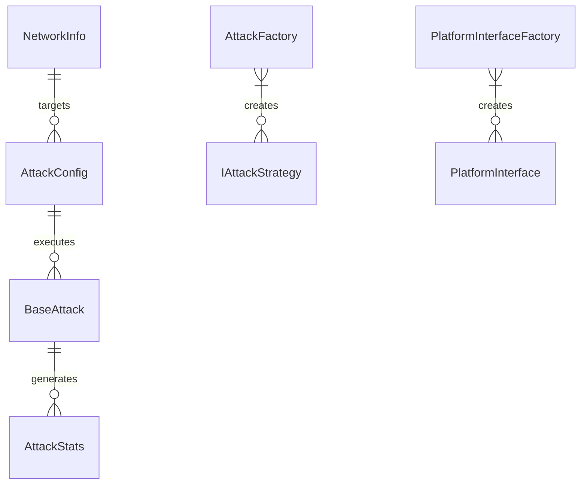
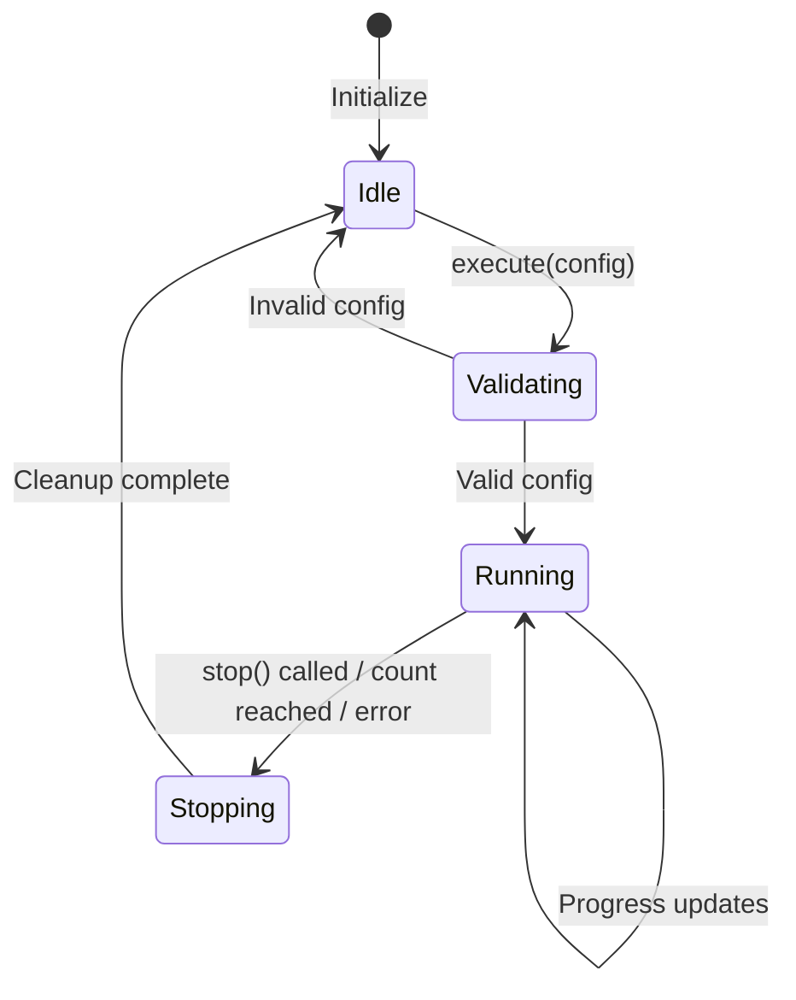
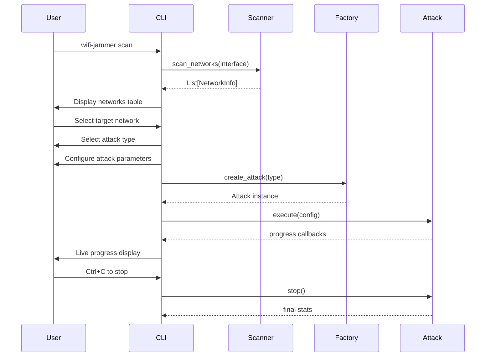
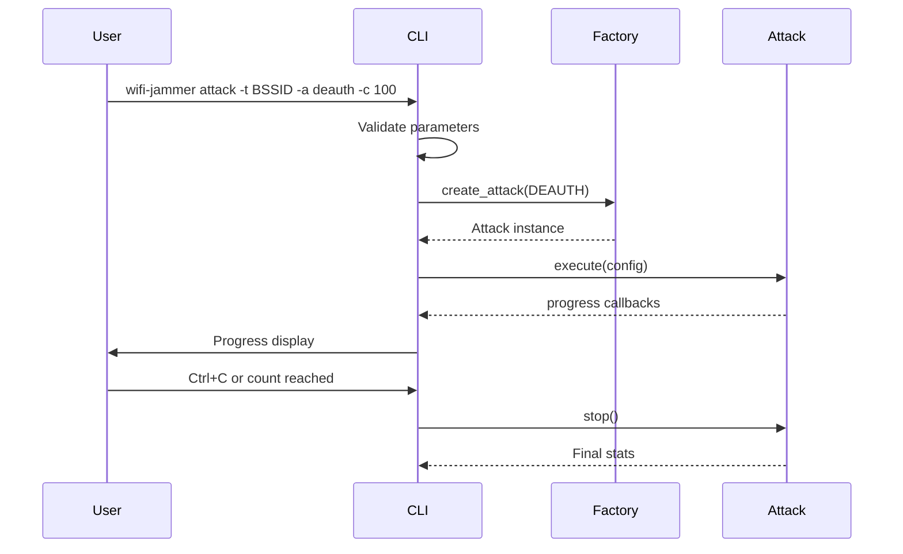
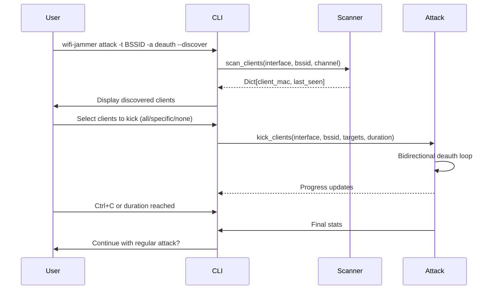

# WiFi Jammer Tool - Business Flows

## Domain Model

### Core Entities

### Entity Definitions

#### NetworkInfo
Represents a discovered WiFi network:
- `ssid`: Network name (may be hidden)
- `bssid`: MAC address of AP (primary key)
- `channel`: WiFi channel (1-14, 36-165)
- `rssi`: Signal strength in dBm
- `encryption`: Security protocol (WPA2, WPA3, WEP, Open)
- `clients`: Connected client MAC addresses

#### AttackConfig
Immutable configuration for attack execution:
- `attack_type`: AttackType enum (DEAUTH, DISASSOC, BEACON_FLOOD, etc.)
- `target_bssid`: Target AP MAC (required)
- `target_ssid`: Target SSID (optional)
- `interface`: Wireless interface name (required)
- `channel`: WiFi channel (required for effective attacks)
- `count`: Packet count (0 = unlimited)
- `delay`: Inter-packet delay in seconds (default 0.1)
- `target_client`: Specific client MAC for targeted attacks
- `source_mac`: Source MAC (random if empty)
- `verbose`: Enable detailed logging

#### AttackStats
Real-time attack statistics:
- `packets_sent`: Successful packet count
- `packets_failed`: Failed packet count
- `start_time`: Attack start timestamp
- `last_packet_time`: Last successful packet timestamp
- `errors`: List of error messages

Computed properties:
- `duration`: Seconds since start
- `packets_per_second`: Rate calculation
- `success_rate`: Percentage of successful packets

## Business Rules & Invariants

### Attack Execution Rules
1. **Privilege Requirement**: All attacks require root/admin privileges
2. **Interface Validation**: Wireless interface must exist and be available
3. **Channel Validation**: Must be valid WiFi channel (1-14 for 2.4GHz, 36-165 for 5GHz)
4. **BSSID Format**: Must be valid MAC address (XX:XX:XX:XX:XX:XX)
5. **Count Non-negative**: Packet count must be >= 0
6. **Delay Range**: Inter-packet delay must be 0.0 to 60.0 seconds
7. **Target Consistency**: If target_client specified, target_bssid must also be set

### Attack State Machine

### Attack Constraints
1. **Single Attack**: Only one attack can run at a time per instance
2. **Clean Stop**: Stop() must wait for thread completion (2s timeout)
3. **Progress Reporting**: Optional callback for real-time stats
4. **Error Handling**: Max 5 consecutive send failures before abort
5. **Permission Errors**: Immediate stop on permission denied

## Key Business Flows

### Flow 1: Interactive Network Scan & Attack

### Flow 2: Direct Command Attack

### Flow 3: Client Discovery & Targeted Kick

## User Roles & Permissions

| Role | Capabilities | Constraints |
|------|-------------|-------------|
| **Admin/Root** | Full attack execution, all interfaces | Must run as root/admin |
| **Non-root User** | Network scanning only | Attacks blocked with warning |
| **Automated/CI** | Direct command execution | Requires explicit params |

## Error Handling & Edge Cases

### Common Error Scenarios
| Scenario | Detection | Response |
|----------|-----------|----------|
| No root privileges | `os.geteuid() != 0` | Warning, attack blocked |
| Invalid interface | Not in `get_all_interfaces()` | Error, show available |
| Invalid BSSID | Regex validation fails | Error, format hint |
| No networks found | Empty scan results | Warning, retry suggestion |
| Permission denied | `sendp()` raises OSError | Immediate stop, error msg |
| Scan timeout | Thread join timeout | Warning, partial results |
| No networks found | Empty `networks` list | Warning, check interface |

### Recovery Strategies
1. **Graceful Degradation**: Scan works without root, attacks blocked
2. **Timeout Protection**: 30s scan timeout, 30s packet send timeout
3. **Graceful Stop**: Thread join with 2s timeout, force cleanup
3. **Error Aggregation**: Collect errors in stats, report on stop
4. **Resource Cleanup**: Thread join, interface state awareness

## Data Retention & Privacy

- **No persistent storage**: All data in memory only
- **No network transmission**: Tool only sends/receives local packets
- **No user tracking**: No telemetry, analytics, or external calls
- **Config files**: Optional YAML for default parameters only
- **Log files**: Optional file output, user-controlled

## Integration Points

### External Dependencies
- **Scapy**: Packet crafting and sniffing (required)
- **Rich**: Terminal formatting (required)
- **Textual**: TUI framework (optional)
- **PyQt6**: GUI framework (optional)
- **Cryptography**: AES-GCM (required for crypto utils)

### Extension Points
1. **Custom Attacks**: Implement `IAttackStrategy`, register via `AttackFactory.register_attack()`
2. **Custom Platforms**: Implement `IPlatformInterface`
3. **Custom Loggers**: Implement `ILogger` interface
4. **Custom Scanners**: Implement `INetworkScanner` interface